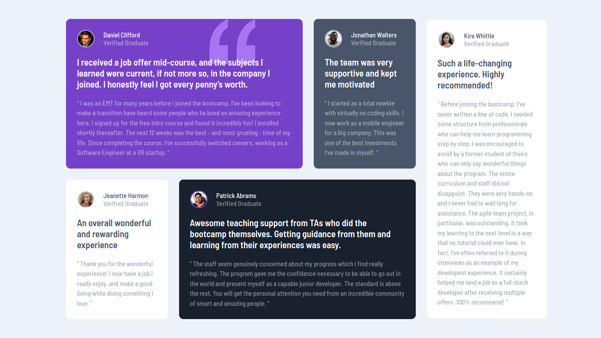

# Frontend Mentor Testimonials Section Challenge

This is my solution to the Testimonials Section challenge on Frontend Mentor. In this challenge, I have created a responsive testimonial section for desktop devices.

## Challenge Description

Frontend Mentor is a platform that offers web development challenges to help improve your coding skills. The Testimonials Section challenge is one of these challenges. The goal of this challenge is to build a testimonials section based on the given design. The challenge is focused on the desktop version, so responsiveness for mobile devices was not required for this particular project.

## Challenge Specifications

* Display testimonials with text and profile pictures.
* Ensure that the design is responsive and looks good on desktop devices.
* Use HTML and CSS to create the layout and style the components.
* Pay attention to the details and try to match the design as closely as possible.

## My Approach

I approached this challenge by first analyzing the provided design file and breaking it down into its components. I then started by creating the HTML structure for the testimonials section, including the necessary elements for text and images. After that, I utilized CSS to style the layout, fonts, colors, and positioning to closely match the design. I made sure to use best practices in HTML and CSS, such as semantic HTML tags and CSS flexbox for layout, to ensure a clean and maintainable codebase.

## Technologies Used

* HTML
* CSS

## Screenshot

## Conclusion

This challenge was a great opportunity to practice my HTML and CSS skills and to create a responsive testimonials section. I enjoyed working on this project and look forward to more challenges on Frontend Mentor.

If you have any questions or feedback regarding my solution, please feel free to reach out.

Happy coding! 😄🚀

